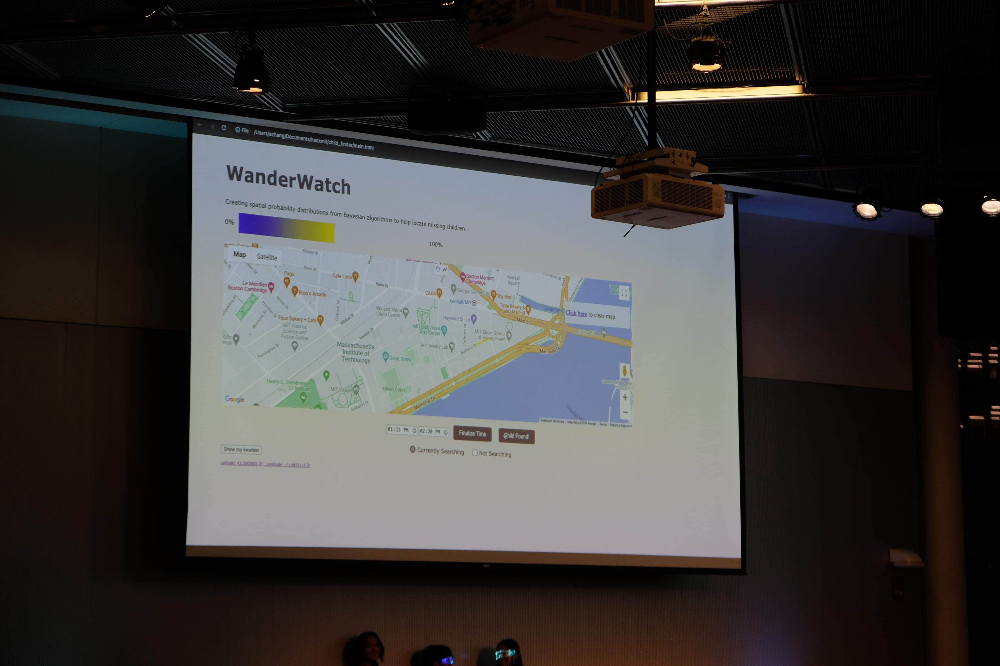

# WanderWatch

## Project Description
According to the Office of Juvenile Justice and Delinquency Prevention, a child goes missing every 40 seconds in the United States. More than 800,000 children are reported missing each year. To help aid the search for missing children, WanderWatch is a web application designed to update the spatial probability distributions of the possible location of a child based on live users in the vicinity. When a user loses their child, they can submit a segment of a road and the time interval that they lost the child. The spatial probabilities of the possible location of the child will update on the map interface.

## Tools Used
* Frontend: HTML, CSS
* Backend: Javascript, Google Maps API, ArcGIS
